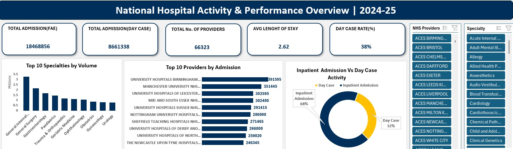

# NHS-Activity-Hospital-Dashboard
Excel dashboard analysing NHS hospital activity, admissions, bed days, and specialty performance (2024–25)

# National Hospital Activity & Performance Overview (2024–25)

## 1. Project Overview

This project provides an analytical overview of NHS hospital activity and performance for the 2024–25 financial year. Using national-level hospital episode statistics (HES), the dashboard examines patterns in admissions, bed utilisation, day case activity, and specialty-level workload.
The objective of the dashboard is to support data-driven decision-making by offering clear visibility into hospital demand, operational pressure, and variation across providers and specialties. The analysis is designed for use by healthcare managers, analysts, and policy stakeholders to monitor performance and identify areas for improvement.
## 2. Business Questions

The dashboard was designed to answer the following key business and operational questions:

- What is the total volume of hospital admissions across England during the 2024–25 period?
- How is activity distributed between inpatient admissions and day case activity?
- Which clinical specialties account for the highest levels of hospital activity?
- How does bed utilisation vary across providers and specialties?
- Where are potential operational pressures or inefficiencies within hospital services?

## 3. Data Source
- **Source:** The analysis is based on publicly available NHS Hospital Episode Statistics (HES) data/ NHS Digital portal for the 2024–25 financial year. The dataset contains aggregated information on hospital activity across England, including admissions, finished consultant episodes (FCEs), bed days, day case activity, and specialty-level breakdowns.
- **Governance Note:** To preserve data integrity while maintaining patient confidentiality, suppressed values within the HES dataset were imputed using a conservative proxy approach to enable consistent aggregation at national and regional levels.

## 4. Key KPIs
The dashboard focuses on the following key performance indicators (KPIs):

- **Total Admissions** (Finished Admission Episodes – FAE)
- **Day Case Activity**  (Finished Consultant Episodes – FCE)
- **Total No of NHS Porviders**
- **Average Length of Stay (ALOS)**
- **Day Case Rate (%)**

## 5. Dashboard Design

The dashboard was designed in Excel with a clear, user-focused layout to support quick interpretation and exploration of hospital activity data.

**Key design features include:**
- High-level KPI cards summarising admissions, bed days, and length of stay
- Comparative visualisations showing inpatient activity versus day case activity
- Specialty-level charts highlighting areas of highest demand
- Provider-level analysis to support benchmarking and performance comparison
- Interactive slicers enabling users to filter results by provider and specialty
  
# National Hospital Activity & Performance Overview | 2024–25

## 📊 Dashboard Preview

*Figure 1: Interactive NHS Performance Dashboard featuring KPI cards and admission volume charts.*

## 6. Analysis & Insights

The dashboard highlights several key insights into NHS hospital activity and operational pressure during the 2024–25 period:

- Total hospital admissions reached approximately **18.5 million (FAE)**, indicating sustained national demand on secondary care services.

- **Day case activity accounted for around 32% of total admissions**, while inpatient admissions represented **68%**, demonstrating continued reliance on overnight care and associated bed capacity pressures.

- Average length of stay across providers was **2.62 days**, suggesting moderate bed turnover but with potential variation driven by specialty mix and clinical complexity.

- A small number of clinical specialties, including **General Internal Medicine and General Surgery**, accounted for the highest volumes of hospital activity, highlighting key pressure points within the system.

- Hospital activity was concentrated among a limited number of large providers, with **teaching and major acute trusts** recording the highest admission volumes, indicating opportunities for benchmarking and performance comparison.

Overall, the analysis suggests that while day case services play a significant role in managing demand, inpatient care remains the dominant driver of bed utilisation and operational pressure across the NHS.

### Insights by Visual

**KPI Summary Cards**  
The headline KPIs provide a high-level view of national hospital demand, highlighting high admission volumes, sustained inpatient reliance, and moderate average length of stay, all of which point to continued operational pressure on bed capacity.

**Top 10 Specialties by Volume**  
Hospital activity is heavily concentrated within a small number of specialties, particularly General Internal Medicine and General Surgery. This concentration suggests that targeted interventions in these specialties could yield significant system-wide impact.

**Top 10 Providers by Admission**  
Admissions are dominated by large acute and teaching trusts, indicating variation in service scale and demand. This presents opportunities for benchmarking performance and identifying best practices across providers.

**Inpatient Admission vs Day Case Activity**  
The inpatient-to-day case split shows a clear predominance of inpatient care, reinforcing the importance of expanding day case pathways where clinically appropriate to relieve bed pressure.

## 7. Tools & Techniques

The project applied a structured data cleansing and transformation workflow in Microsoft Excel to ensure accuracy, consistency, and statistical validity of all reported metrics.

- **Microsoft Excel**: Used for data preparation, transformation, aggregation, and dashboard development.
- **Data Cleansing & Preparation**:
  - Applied trimming functions to remove whitespace, ensuring accurate lookups and joins.
  - Performed de-duplication to remove redundant records and maintain the integrity of patient activity counts.
  - Converted data types systematically from text to numeric formats to support reliable aggregation and KPI calculation.
- **Data Transformation & Logic**:
  - Implemented logical IF statements to handle suppressed values, enabling numerical analysis while preserving data consistency.
  - Standardised measures to ensure consistent KPI definitions across the dashboard.
- **Data Integration**:
  - Used VLOOKUP to map NHS specialty codes to descriptive specialty names using official NHS reference tables.
- **Dashboard Interactivity**:
  - Built interactive slicers and dynamic charts to support exploratory analysis by provider and specialty.

## 8. Limitations

This analysis is subject to several limitations:

- The dataset is aggregated at national and provider level, limiting the ability to perform patient-level or pathway-specific analysis.
- Suppressed values within the source data required estimation logic, which may introduce minor approximation in aggregated metrics.
- The dashboard focuses on activity and utilisation metrics and does not incorporate clinical outcome measures.
- Analysis is limited to the 2024–25 period and does not capture longer-term trends or seasonal variation.

## 9. Recommendations
Based on the analysis, the following recommendations could support improved operational planning and performance monitoring:

- Expand day case pathways where clinically appropriate to reduce pressure on inpatient bed capacity.
- Use specialty-level activity data to prioritise service redesign and targeted efficiency initiatives.
- Apply provider-level benchmarking to identify best practices and reduce unwarranted variation in hospital activity.
- Monitor average length of stay alongside admission volumes to improve patient flow and discharge planning.
- Extend the analysis across multiple financial years to identify trends, seasonality, and long-term demand patterns.

